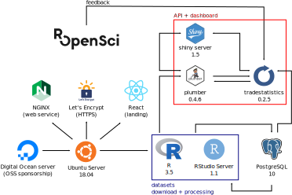
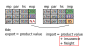
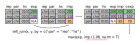
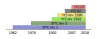

```{r setup, include=FALSE}
knitr::opts_chunk$set(echo = FALSE, cache = TRUE, message = FALSE, warning = FALSE)
```


## Contents of the talk

* Introduction
* API
* R Package
* Dashboard
* Code and documentation

---

## Where to reach me

**Twitter and Github: `pachamaltese`**

**Email: `m vargas at dcc dot uchile dot cl`**

**Phone: `+1 XXX XXX XX XX or +56 X X XXX XX XX`**

---

# Introduction

---

## Introduction

* [Open Trade Statistics](https://tradestatistics.io) (OTS) was created with the intention to lower the barrier to working with international economic trade data.

* It includes a public API, a dashboard, and an R package for data retrieval.

* The project started when I was affected by the fact that many Latin American Universities have limited or no access to the [United Nations Commodity Trade Statistics Database](https://comtrade.un.org/) (UN COMTRADE).

---

## Introduction

* There are alternatives to COMTRADE.

* Example: The [Base Pour L'Analyse du Commerce International](http://www.cepii.fr/CEPII/en/bdd_modele/presentation.asp?id=1) (BACI).

* BACI remarkables: It is constructed using the raw data and a method that reconciles the declarations of the exporter and the importer.

* You need UN COMTRADE institutional paid access to access BACI.

---

## Introduction

* I contacted UN COMTRADE.

* My proposal was to do something similar to BACI but available for anyone.

* COMTRADE agreed as long as it kept commercial purposes out of the scope of the project.

---

## Introduction

After many emails I got a temporary access to download the raw data.


---

## Introduction

The project has a major reproducibility flaw: You can reproduce the steps to
obtain the curated data if you already have the raw data.


---

## Introduction

Hardware and software stack



---

## Introduction

The next three slides are an *oversimplification* just to explain the work in
wide terms.

---

## Introduction

The raw data contains missing flows and the data is not tidy data:



---

## Introduction

We can patch this applying some articles:



---

## Introduction

Customs have changed their coding systems in order to reflect changes
in exported products (i.e. in 1960 nobody exported laptops).



---

## Introduction

* We have 2018 data, similar initiatives have datasets updated to 2016 or 2017.
* But *much* more important than that, we converted all years to HS rev 2007 to
allow time comparisons.

---

## Introduction

The HS consists in nested codes. This is important as it allow to
convert between classifications:


---

## Introduction

Product code conversion is far from a 1-to-1 map. The solution is an
intrincate `group_by() + left_join()`:


---

# API

---

## Comparison between APIs

Similar projects:

* [The Atlas of Economic complexity](http://atlas.cid.harvard.edu/)
* [The Obervatory of Economic complexity](http://atlas.media.mit.edu/)

Both use UN COMTRADE data and focus on data visualization to answer questions like:

* Who imported Electronics in 1980?
* Who exported Refined Copper in 1990?
* Where did Chile export Wine to in 2016?

---

## Comparison between APIs

As a simple example, I shall compare three APIs by extracting what did Chile export to Argentina, Bolivia and Perú in 2016.

This shall be made by using common R packages:

```{r packages, echo=TRUE}
library(jsonlite)
library(dplyr)
library(purrr)
```

---

## Comparison between APIs

### Open Trade Statistics

* docs.tradestatistics.io has fully detailed explanations to use the API

* In case of not knowing the ISO codes for the country of origin or destination, I can check api.tradestatistics.io/countries and inspect it from the browser.

---

## Comparison between APIs

### Open Trade Statistics

```{r ots_api_1, echo=TRUE}
# Function to read each combination reporter-partners
read_from_ots <- function(p) {
  fromJSON(sprintf("https://api.tradestatistics.io/yrpc?y=2016&r=chl&p=%s", p))
}

# The ISO codes are here: https://api.tradestatistics.io/countries
partners <- c("arg", "bol", "per")

# Now with purrr I can combine the three resulting datasets
# Chile-Argentina, Chile-Bolivia, and Chile-Perú
ots_data <- map_df(partners, read_from_ots)
```

---

## Comparison between APIs

### Open Trade Statistics

```{r ots_api_2}
# Preview the data
as_tibble(ots_data)
```

---

## Comparison between APIs

### Open Trade Statistics

* I got tidy data but I still cannot answer the original question.

* I can use the API again to join two tables.

* I'll obtain the product information and then I'll group the data by groups of products.

* The answer has to be *informative*

---

## Comparison between APIs

### Open Trade Statistics

```{r ots_api_3, echo=TRUE}
# Product information
products <- fromJSON("https://api.tradestatistics.io/products")

# Join the two tables and then summarise by product group
# This will condense the original table into something more compact
# and even probably more informative
ots_data_2 <- ots_data %>%
  left_join(products, by = "product_code") %>%
  group_by(group_name) %>%
  summarise(export_value_usd = sum(export_value_usd, na.rm = T)) %>%
  arrange(-export_value_usd)
```

---

## Comparison between APIs

### Open Trade Statistics

Now I can say that in 2016, Chile exported primarily vehicles to Argentina, Bolivia and Perú.

```{r ots_api_4}
ots_data_2
```

---

## Comparison between APIs

### The Observatory of Economic Complexity

* This API is documented at atlas.media.mit.edu/api.

* I'll try to replicate the result from OTS API.

---

## Comparison between APIs

### The Observatory of Economic Complexity

```{r oec_api_1, echo=TRUE}
# Function to read each combination reporter-partners
read_from_oec <- function(p) {
  fromJSON(sprintf("https://atlas.media.mit.edu/hs07/export/2016/chl/%s/show/", p))
}

# From their documentation I can infer their links use ISO codes for countries,
# so I'll use the same codes from the previous example
destination <- c("arg", "bol", "per")

# One problem here is that the API returns a nested JSON that doesn't work with map_df
# I can obtain the same result with map and bind_rows
oec_data <- map(destination, read_from_oec)
oec_data <- bind_rows(oec_data[[1]]$data, oec_data[[2]]$data, oec_data[[3]]$data)
```

---

## Comparison between APIs

### The Observatory of Economic Complexity

```{r oec_api_2}
oec_data %>% 
  select(dest_id, hs07_id, hs07_id_len, export_val) %>% 
  as_tibble()
```

Problems:

* Post-filtering is required at `hs07_id` as there are mixed length HS codes
* There are no 8 digits HS codes!
* Here 6 digits means 4 digits and 8 means 6

---

## Comparison between APIs

### The Observatory of Economic Complexity

Let's filter with this consideration in mind:

```{r oec_api_3, echo=TRUE}
# Remember that this is a "false 6", and is a "4" actually
oec_data_2 <- oec_data %>%
  filter(hs07_id_len == 6) %>% 
  mutate(hs07_id = substr(hs07_id, 3, 6)) %>% 
  select(dest_id, hs07_id, export_val) %>% 
  as_tibble()
```

---

## Comparison between APIs

### The Observatory of Economic Complexity

```{r oec_api_4}
oec_data_2
```

---

## Comparison between APIs

### The Atlas of Economic Complexity

* I couldn't find documentation for this API

* Still I'll try to replicate the result from OTS API (I obtained the URL by using Firefox inspector at their website

---

## Comparison between APIs

### The Atlas of Economic Complexity


---

## Comparison between APIs

### The Atlas of Economic Complexity


---

## Comparison between APIs

### The Atlas of Economic Complexity

```{r aec_api_1, echo=TRUE}
# Function to read each combination reporter-partners
read_from_atlas <- function(p) {
  fromJSON(sprintf("http://atlas.cid.harvard.edu/api/data/location/42/hs_products_by_partner/%s/?level=4digit", p))
}

# Getting to know these codes required web scraping from http://atlas.cid.harvard.edu/explore
# These codes don't follow UN COMTRADE numeric codes with are an alternative to ISO codes
destination <- c("8", "31", "173")

# The resulting JSON doesn't work with map_df either
# This can still be combined without much hassle
atlas_data <- map(destination, read_from_atlas)
atlas_data <- bind_rows(atlas_data[[1]]$data, atlas_data[[2]]$data, atlas_data[[3]]$data)
```

---

## Comparison between APIs

### The Atlas of Economic Complexity

```{r aec_api_2}
atlas_data %>% 
  select(year, partner_id, product_id, export_value) %>% 
  as_tibble()
```

Problems:

* Post-filtering is required at year as there are more years than what was requested.
* `product_id` is of class `integer`. How about official HS codes such as `0101`? 
* Some scraping indicates that the `product_id` is linked to HS codes.

---

## Comparison between APIs

### The Atlas of Economic Complexity

```{r aec_api_3, echo=TRUE}
atlas_id_to_hs <- fromJSON("http://atlas.cid.harvard.edu/api/metadata/hs_product/")
atlas_id_to_hs <- atlas_id_to_hs$data %>% select(id, code)

atlas_id_to_iso <- fromJSON("http://atlas.cid.harvard.edu/api/metadata/location/")
atlas_id_to_iso <- atlas_id_to_iso$data %>% select(id, code)

atlas_data_2 <- atlas_data %>% 
  left_join(atlas_id_to_hs, by = c("product_id" = "id")) %>% 
  left_join(atlas_id_to_iso, by = c("partner_id" = "id"))
```

---

## Comparison between APIs

### The Atlas of Economic Complexity

```{r aec_api_4}
atlas_data_2 %>%
  filter(year == 2016) %>% 
  select(code.y, code.x, export_value) %>% 
  as_tibble()
```

---

# R package

---

## R package

Let's go easy

```r
# easy start
install.packages("tradestatistics")
```

---

## R package

With more time we should have done (but it requires `devtools` and more, and I don't want
you to spend the rest of the presentation installing packages)

```r
# reproducible start
if (!require("pacman")) install.packages("pacman")
pacman::p_load(tradestatistics)
```

---

## R package

Fiji exports a lot of water. But how much of its exports to the US are actually water?

```{r ts_1, echo=TRUE}
library(dplyr)
library(tradestatistics)

fji_usa <- ots_create_tidy_data(
  years = 2017, reporters = "fji", partners = "usa",
  include_shortnames = T
)
```

---

## R package

```{r ts_2}
fji_usa %>% 
  select(product_shortname_english, export_value_usd) %>% 
  arrange(-export_value_usd) %>% 
  mutate(export_value_share = round(100 * export_value_usd /
                                      sum(export_value_usd, na.rm = T), 2))
```

---

## R package

Which country from America is the #1 partner with the European Union (EU-28)?

```{r ts_3, echo=TRUE}
eu28 <- ots_countries %>% 
  filter(eu28_member == 1) %>% 
  select(country_iso)

ame_eu28 <- ots_create_tidy_data(
  years = 2017, reporters = "c-am", partners = "all",
  table = "yrp"
)
```

---

```{r ts_4, echo = TRUE}
ame_eu28_2 <- ame_eu28 %>% 
  mutate(is_eu28 = ifelse(partner_iso %in% eu28$country_iso, 1, 0)) %>% 
  
  group_by(reporter_iso, is_eu28) %>% 
  summarise(export_value_usd = sum(export_value_usd, na.rm = T)) %>% 
  
  group_by(reporter_iso) %>%
  mutate(pct_to_eu28 = export_value_usd / sum(export_value_usd, na.rm = T)) %>% 
  
  filter(is_eu28 == 1) %>% 
  select(reporter_iso, export_value_usd, pct_to_eu28) %>% 
  arrange(-export_value_usd)
```

---

```{r ts_5}
ame_eu28_2
```

---

# Dashboard

---

## Dashboard

shiny.tradestatistics.io

---

## Code and documentation

**github.com/tradestatistics**

**docs.ropensci.org/tradestatistics**

**tradestatistics.io**

---

## Related packages

* Gravity (CRAN): Complex econometric models for international trade
* Economiccomplexity (CRAN): Recursive methods for international trade


---

## Acknowledgements

* rOpenSci <3: Amanda, Emily, Jorge, Maelle, Mark and Stefanie
* DigitalOcean: Danny
* Unaffiliated: Joshua and Erasmo

---

# Thanks for your attention! Please follow @ropensci
